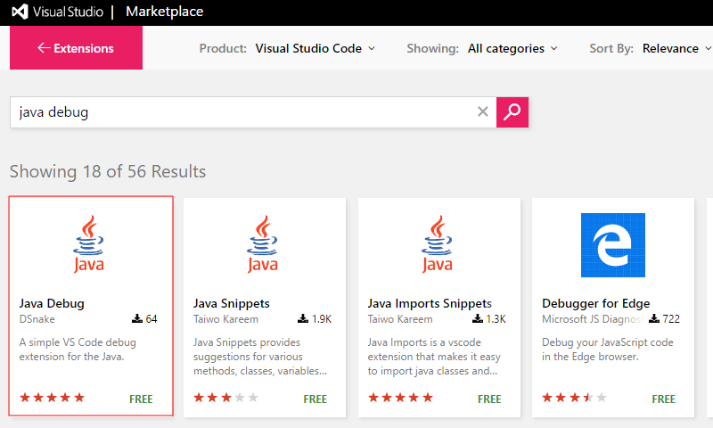
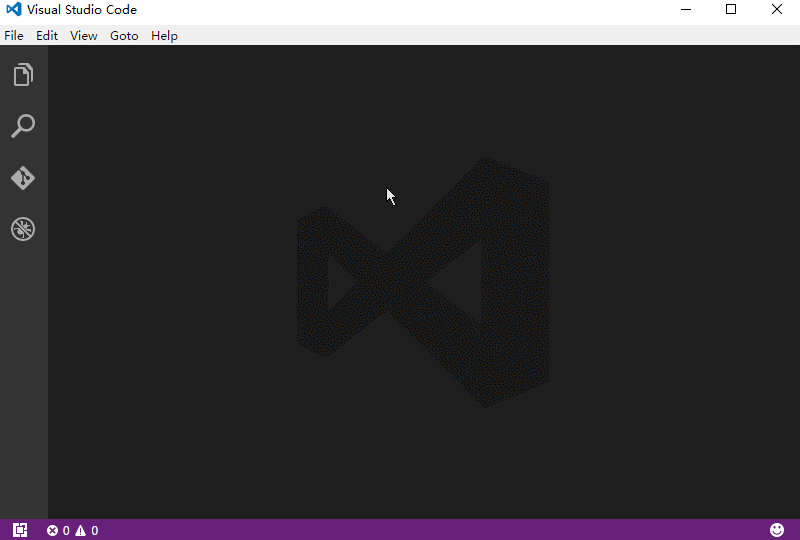

# [Java Debug](http://d-snake.github.io/vscode-java-debug)

A simple debug extension for the Java. It is based on the javac command line debugger.

##Functionality
First, toggle output:

> Ctrl + Shift + U

To compile selected file:

> Alt + C
    
To run compiled class of selected file.
 
> Alt + R

##Install
Open up VS Code and hit F1 and type ext select "Extensions:Install Extension" and type "java-debug" hit enter and reload window to enable.

##Fork
> git clone https://github.com/D-Snake/vscode-java-debug.git

##Feedback
+ [E-mail Me](mailto:dengbin80@live.com)
+ File a bug in [*GitHub Issues*](https://github.com/D-Snake/vscode-java-debug/issues).

## License
>Apache License 2.0

##Note
+ Requires [Java Development Kit](http://www.oracle.com/technetwork/java/javase/downloads/index.html).
+ *JAVA_HOME* environment variable should be settled and add to *PATH* environment variable aslo needed.